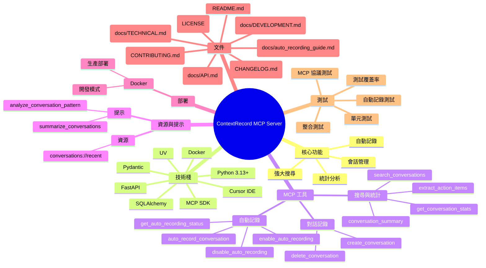

# 🎯 ContextRecord MCP Server

<div align="center">


**一個強大的 MCP (Model Context Protocol) 伺服器，專為 AI 助理系統設計的對話記錄與搜尋解決方案**

[功能特色](#-功能特色) • [快速開始](#-快速開始) • [配置說明](#-配置說明) • [API 文件](#-api-文件) • [技術文件](#-技術文件)

</div>

---

## 🧠 專案心智圖



---

## 📋 目錄

- [🎯 ContextRecord MCP Server](#-contextrecord-mcp-server)
  - [📋 目錄](#-目錄)
  - [🌟 功能特色](#-功能特色)
  - [🚀 快速開始](#-快速開始)
    - [環境需求](#環境需求)
    - [安裝步驟](#安裝步驟)
    - [Cursor IDE 配置](#cursor-ide-配置)
  - [🔧 配置說明](#-配置說明)
    - [環境變數](#環境變數)
    - [資料庫配置](#資料庫配置)
  - [🛠️ 可用工具](#️-可用工具)
    - [對話記錄工具](#對話記錄工具)
    - [自動記錄工具](#自動記錄工具)
    - [搜尋與統計工具](#搜尋與統計工具)
  - [📚 資源與提示](#-資源與提示)
  - [💡 使用範例](#-使用範例)
    - [基本對話記錄](#基本對話記錄)
    - [自動記錄設定](#自動記錄設定)
    - [搜尋與查詢](#搜尋與查詢)
  - [🧪 測試](#-測試)
  - [📖 技術文件](#-技術文件)
  - [🐳 Docker 部署](#-docker-部署)
  - [🤝 貢獻指南](#-貢獻指南)
  - [📄 授權](#-授權)
  - [🙏 致謝](#-致謝)

---

## 🌟 功能特色

### 🎯 核心功能
- **🔄 自動記錄**: 智能記錄每次對話交互，支援選擇性記錄
- **🔍 強大搜尋**: 基於關鍵字的快速對話搜尋功能
- **📊 統計分析**: 提供詳細的對話統計與分析報告
- **🗂️ 會話管理**: 支援多會話獨立配置與管理

### 🛡️ 技術特性
- **⚡ 高效能**: 基於 SQLAlchemy 異步 ORM，支援高併發
- **🔌 MCP 標準**: 完全符合 Model Context Protocol 規範
- **🐳 容器化**: 支援 Docker 部署，開發與生產環境一致
- **🔧 靈活配置**: 豐富的配置選項，適應不同使用場景

### 🎨 開發體驗
- **🚀 即插即用**: 簡單配置即可整合到 Cursor IDE
- **📝 完整文件**: 詳細的 API 文件與使用範例
- **🧪 全面測試**: 完整的測試覆蓋，確保功能穩定性

---

## 🚀 快速開始

### 環境需求

- **Python**: 3.13+
- **UV**: 包管理工具
- **Cursor IDE**: 支援 MCP 的 IDE
- **Docker** (可選): 用於容器化部署

### 安裝步驟

1. **克隆專案**
```bash
   git clone https://github.com/Gamepig/ContextRecord.git
cd ContextRecord
```

2. **建立虛擬環境**
   ```bash
   uv venv
   source .venv/bin/activate  # Linux/macOS
   # 或
   .venv\Scripts\activate     # Windows
   ```

3. **安裝依賴**
   ```bash
   uv pip install -r requirements.txt
   ```

4. **初始化資料庫**
   ```bash
   python src/mcp_server.py
   ```

### Cursor IDE 配置

在 `~/.cursor/mcp.json` 中添加以下配置：

```json
{
  "mcpServers": {
    "contextrecord": {
      "command": "/path/to/your/project/.venv/bin/python",
      "args": ["/path/to/your/project/src/mcp_server.py"],
      "env": {
        "DATABASE_PATH": "/path/to/your/project/data/conversations.db"
      }
    }
  }
}
```

> 💡 **提示**: 請將路徑替換為您的實際專案路徑

---

## 🔧 配置說明

### 環境變數

| 變數名 | 預設值 | 說明 |
|--------|--------|------|
| `DATABASE_PATH` | `data/conversations.db` | 資料庫檔案路徑 |

### 資料庫配置

ContextRecord 使用 SQLite 作為預設資料庫，支援以下配置：

- **開發環境**: SQLite (輕量級，無需額外設定)
- **生產環境**: 可擴展至 PostgreSQL (需修改連接字串)

---

## 🛠️ 可用工具

### 對話記錄工具

#### `create_conversation`
創建新的對話記錄

**參數**:
- `role` (string): 對話角色 (`user` 或 `assistant`)
- `content` (string): 對話內容
- `metadata` (string, 可選): JSON 格式的元數據

### 自動記錄工具

#### `enable_auto_recording`
啟用自動記錄功能

**參數**:
- `session_id` (string, 預設: "default"): 會話識別碼
- `record_user` (boolean, 預設: true): 是否記錄用戶訊息
- `record_assistant` (boolean, 預設: true): 是否記錄助理回應

#### `auto_record_conversation`
自動記錄對話交互

**參數**:
- `user_message` (string): 用戶訊息
- `assistant_response` (string): 助理回應
- `session_id` (string, 可選): 會話識別碼
- `context` (string, 可選): JSON 格式的上下文資訊

#### `disable_auto_recording`
停用自動記錄功能

**參數**:
- `session_id` (string, 預設: "default"): 會話識別碼

#### `get_auto_recording_status`
獲取自動記錄狀態

**參數**:
- `session_id` (string, 預設: "default"): 會話識別碼

### 搜尋與統計工具

#### `search_conversations`
搜尋對話記錄

**參數**:
- `query` (string): 搜尋關鍵字
- `limit` (integer, 預設: 10): 返回結果數量限制

#### `get_conversation_stats`
獲取對話統計資訊

**參數**: 無

#### `delete_conversation`
刪除指定對話記錄

**參數**:
- `conversation_id` (integer): 要刪除的對話 ID

#### `conversation_summary`
根據提供的對話 ID 生成對話摘要

**參數**:
- `conversation_ids` (array of integer): 要生成摘要的對話 ID 列表

#### `extract_action_items`
從指定的對話記錄中提取行動項目

**參數**:
- `conversation_ids` (array of integer): 要提取行動項目的對話 ID 列表

---

## 📚 資源與提示

### 資源 (Resources)
- **`conversations://recent`**: 獲取最近的對話記錄

### 提示 (Prompts)
- **`analyze_conversation_pattern`**: 分析對話模式
- **`summarize_conversations`**: 總結對話記錄

---

## 💡 使用範例

### 基本對話記錄

```python
# 在 Cursor IDE 中使用 ContextRecord 工具
create_conversation(
    role="user",
    content="這是一個測試對話",
    metadata='{"project": "test", "priority": "high"}'
)
```

### 自動記錄設定

```python
# 1. 啟用自動記錄
enable_auto_recording(
    session_id="my_project",
    record_user=True,
    record_assistant=True
)

# 2. 自動記錄對話
auto_record_conversation(
    user_message="如何使用自動記錄功能？",
    assistant_response="您可以使用 enable_auto_recording 工具來啟用自動記錄。",
    session_id="my_project",
    context='{"topic": "功能使用", "difficulty": "beginner"}'
)

# 3. 檢查狀態
get_auto_recording_status(session_id="my_project")
```

### 搜尋與查詢

```python
# 搜尋特定主題的對話
search_conversations(
    query="自動記錄",
    limit=5
)

# 獲取統計資訊
get_conversation_stats()
```

---

## 🧪 測試

### 運行測試

```bash
# 運行所有測試
PYTHONPATH=. pytest tests/ -v

# 運行特定測試類別
PYTHONPATH=. pytest tests/test_conversations.py -v  # 對話功能測試
PYTHONPATH=. pytest tests/test_mcp_tools.py -v      # MCP 工具測試
PYTHONPATH=. pytest tests/test_auto_recording.py -v # 自動記錄功能測試

# 運行基本功能測試
PYTHONPATH=. pytest tests/test_main.py tests/test_server.py -v
```

### 專項測試

```bash
# MCP Server 完整測試
cd tests && python test_mcp_server.py

# STDIO 通信測試
cd tests && python test_mcp_stdio.py

# 簡化測試
cd tests && python simple_test.py
```

### 測試覆蓋率

```bash
# 安裝測試覆蓋率工具
uv pip install pytest-cov

# 運行測試並生成覆蓋率報告
PYTHONPATH=. pytest tests/ --cov=src --cov-report=html
```

### 手動測試

```bash
# 直接運行 MCP Server
python src/mcp_server.py

# 使用 MCP 開發工具
mcp dev src/mcp_server.py
```

---

## 📖 技術文件

詳細的技術文件請參考：
- [API 文件](docs/API.md) - 完整的 API 參考
- [技術架構](docs/TECHNICAL.md) - 系統架構與設計說明
- [開發指南](docs/DEVELOPMENT.md) - 開發環境設定與貢獻指南

---

## 🐳 Docker 部署

### 開發模式

```bash
# 啟動開發環境
docker-compose up -d

# 查看日誌
docker-compose logs -f contextrecord
```

### 生產部署

```bash
# 建構生產映像
docker build -t contextrecord:latest .

# 運行容器
docker run -d \
  --name contextrecord \
  -p 8812:8811 \
  -v $(pwd)/data:/app/data \
  contextrecord:latest
```

---

## 🤝 貢獻指南

我們歡迎所有形式的貢獻！請參考 [貢獻指南](CONTRIBUTING.md) 了解詳細資訊。

### 開發流程

1. Fork 專案
2. 創建功能分支 (`git checkout -b feature/amazing-feature`)
3. 提交變更 (`git commit -m 'Add amazing feature'`)
4. 推送分支 (`git push origin feature/amazing-feature`)
5. 開啟 Pull Request

---

## 📄 授權

本專案採用 MIT 授權條款 - 詳見 [LICENSE](LICENSE) 檔案。

---

## 🙏 致謝

- [Model Context Protocol](https://modelcontextprotocol.io/) - 提供標準化的 AI 工具整合協議
- [FastAPI](https://fastapi.tiangolo.com/) - 現代化的 Python Web 框架
- [SQLAlchemy](https://sqlalchemy.org/) - 強大的 Python ORM
- [Cursor IDE](https://cursor.sh/) - 支援 MCP 的智能 IDE

---

<div align="center">

**如果這個專案對您有幫助，請給我們一個 ⭐️**

[回到頂部](#-contextrecord-mcp-server)

</div> 